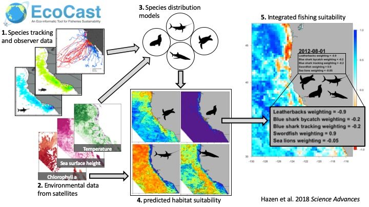

This R Markdown file will walk you through environmentally sampled presences and absences and through options of model fitting using boosted regression trees and generalized additive mixed models. 

# Introduction {-}

In this exercise, you'll predict the distribution of a species using the software packages [dismo](https://cran.r-project.org/web/packages/dismo/index.html) and [mgcv](https://cran.r-project.org/web/packages/mgcv/index.html) -- two statistical techniques used to fit  models differentiating species observations from the background environmental data. For more info on each you can visit the package homepages. You'll use "presence" points from simulated correlated walks, and background samples to simulate absences.

NOTE: if you are using a PC, please make sure to change the directory slashes ("/") to windows friendly ("\")

Here's a figure of the overall process and we'll be doing steps 1 - 4 (although step 2 has already been done for you and step 4 will only be a climatological point map):



# Species Response Data simulated from tagged sharks on the east coast

## Read in species presence (CRW) and absence (background samples) data

These are simulated correlated random walks from a suite of tagged sharks off of the Gulf of Mexico. We also sampled background points for pseudo-absence data to allow us to test if the simulated tracks use different habitat from the actual tracks.

If you want to adapt the code down the line, you can set your working directory (`wd`) and scientific species name (`sp_scientific`) of your chosen species (_Genus species_ only) in the `set_vars` R chunk below.

```{r set_vars, eval=T}
wd = 'data/'
sp_scientific = 'tshark'
```

## Load data from RDS files

The next R chunk fetches the pre-prepared datasets for you to model. If you are interested in the environmental data sampling, please check out [the code 3a & 3b](https://github.com/elhazen/EcoCast-SciAdv). For prediction particularly in an automated setting, see [Heather Welch's code.](https://github.com/HeatherWelch/EcoCast_Operationalization). We will be doing a very "lite" version of this as part of the tutorial.

```{r get_gbif, eval=T, fig.show='hold', warnings = F, messages = F}
# load libraries
suppressPackageStartupMessages(suppressWarnings({
  #library(devtools)
  #devtools::install_github("rspatial/dismo")
  library(sp)
  library(rgdal)
  library(raster)
  library(dismo)
  library(adehabitatLT) # help(package='adehabitat') # help.search('angle',package='adehabitat')
  library(maps)       # for map.where
  library(mapdata)    # for worldHires
  library(sp)
  library(maptools)
  library(mgcv)
  library(ape)
  library(ncf)
  library(ncdf4)
  library(spdep)
  library(ROCR)
  library(gbm)
  library(tidyverse)
  library(viridis)
  #library(ggmap)
  #library(RgoogleMaps)
  
}))

#function to grab a random absence set for modeling purposes
removeland<-function(dataset,sp.obj){
  pt = SpatialPoints(matrix(c(dataset$lon,dataset$lat), nrow=length(dataset$lon)), proj4string=CRS("+proj=longlat +datum=WGS84"))
  place = over(pt, sp.obj)
  return(dataset[is.na(place),])
}

makedataset<-function(presence,absencedata){
  #numsims<-max(absencedata$iteration)
  datasample<-sample(absencedata$iteration)[1:length(unique(presence$ID))]
  presence$presabs<-1; absencedata$presabs<-0
  common_cols <- intersect(colnames(presence), colnames(absencedata))
    presence<-subset(presence, select = common_cols) 
    absencedata<-subset(absencedata, select = common_cols)
  if(exists("spdata") && is.data.frame(get("spdata"))) rm(spdata)
  for (x in 1:length(unique(presence$ID))){
    inddata<-rbind(presence[which(presence$ID==unique(presence$ID)[x]),],absencedata[absencedata$ID==unique(presence$ID)[x]&absencedata$iteration==datasample[x],])
    if(exists("spdata") && is.data.frame(get("spdata"))) spdata<-rbind(spdata,inddata) else spdata<-inddata
  }
  
  return(spdata)
}

saveAUC <- function(truth, predicted, ...){
  pred <- prediction(as.vector(abs(predicted)), as.vector(truth))    
  roc <- performance(pred,"tpr","fpr")
  auc <- performance(pred,"auc")
  #plot(roc, ...)
  #abline(a=0, b= 1)
  return(auc@y.values)
}

plotROC <- function(truth, predicted, ...){
  pred <- prediction(as.vector(abs(predicted)), as.vector(truth))    
  roc <- performance(pred,"tpr","fpr")
  auc <- performance(pred,"auc")
  plot(roc, ...)
  abline(a=0, b= 1)
  print(auc@y.values)
}


# set working directory
#setwd(wd)
dir.create('spp', showWarnings=F)
# set variables
sp_nospace = str_replace(sp_scientific, ' ', '_')

tsharkabsCRW<-readRDS(file="data/tsharkabsCRW.RDS")
tsharkabsbackgrnd<-readRDS(file="data/tsharkabsbackgrnd.RDS")


```

## Filter by Bounding Box (interactive - NOT WORKING)

If you want to explore a subset of the data, you can restrict observations to your area of interest. To do this, you're provided with an interactive map to draw a bounding box extent around the points of interest.

For the interactive drawing to work, you'll want to go to upper right RStudio menu Chunks -> Run All so the R code is run from the Console. _(Note: Knitting the R Markdown document is not interactive.)_

The bounding box extent is saved to `spp/*_extent.csv` which is read in next time the code runs. (The interactive drawing of bounding box is presented if the file's not found, or defaults to global extent if not run interactively.).

```{r draw_bbox, eval=T, fig.show='hold', warnings = F, messages = F}
# vars
csv_extent = sprintf('spp/%s_extent.csv', sp_nospace)
do_extent  = F

#  for google map background...
  #mymapkey = "pk-tHVbDiymfUL"
  #mygeokey = "Skxe99-adfKeax"

#  register_google(key = key)
#map <- get_map(extent(pts_tshark_pres)[1:4])
#ggmap(map, xlim=extent(pts_tshark_pres)[1:2], ylim=extent(pts_tshark_pres)[3:4])
#ggmap(map) + 
#  geom_point(aes(x = lon, y = lat, colour = Year), data = tsharkabsCRW, alpha = .5)

# plot map of original shark points
pts_tshark_pres = tsharkabsCRW
coordinates(pts_tshark_pres) = ~lon+lat 
#map_gbif = readRDS("data/globalmap.RDS")
#map_background = maps::map('worldHires', xlim=extent(pts_tshark_pres)[1:2], ylim=extent(pts_tshark_pres)[3:4])

map_background = maps::map('worldHires', fill=T, col='transparent')
back.IDs = sapply(strsplit(map_background$names, ":"), function(x) x[1])
back.sp = map2SpatialPolygons(map_background, IDs=back.IDs, proj4string=CRS("+proj=longlat +datum=WGS84"))
  
  
#plot(map_gbif)
points(pts_tshark_pres, pch=16, col=rgb(1, 0, 0, alpha=0.5), cex=0.3)


# if (interactive() & !file.exists(csv_extent)){
#   cat(paste(
#     "You're encouraged to explore limiting the points to a region of interest. ",
#     "In the map plot, please click on the two opposite corners ",
#     "of a bounding box for filtering to use only observation points",
#     "within the box.\n", sep='\n'))
#   extent_filter = drawExtent()
#   print(extent_filter)
#   write.csv(as.matrix(extent_filter), csv_extent, row.names=F)
#   do_extent = T
# }

if (file.exists(csv_extent)){
  extent_filter = extent(as.vector(t(read.csv(csv_extent))))
  plot(extent_filter, col='red', add=T)
} else {
  # default to global
  extent_filter = extent(-120, 100, 10, 80)
  cat(sprintf(paste(
    "NOTE: Not filtering original points for extent",
    "because file '%s/%s' not found"), 
    dirname(csv_extent), basename(csv_extent)))
}
```

Note how many points are in strange locations (e.g. on land!). This is something to be aware of and potentially filter (we will) down the line.

## Partition Points into Training and Test (automatic)

The next R chunk:

1. combines a random subset of presence and absence datapoints

2. Filters the GBIF observation points based on the extent from the previous step, and 

3. Partitions these points randomly into: 

  a. **train** for model fitting (80% of filtered points), and 
  
  b. **test** for model evaluation (20%).

4. Plots train (red) and test (blue) points onto a map (see below).

This exercise is used in the GAMM code below but has not yet been split for the BRTs simply due to time. If you are brave, try creating your own code chunk that calculates AUC from BRT test and training data.

```{r partition_plot_pts, eval=T, fig.show='hold', warnings = F, messages = F}
# vars
#tsharkabsCRW<-readRDS(file="./Data/tsharkabsCRW.RDS")
#tsharkabsbackgrnd<-readRDS(file="./Data/tsharkabsbackgrnd.RDS")

tsharkabsbackgrnd$lon<-tsharkabsbackgrnd$long
sharkdata<-makedataset(tsharkabsCRW[tsharkabsCRW$iteration==1,],tsharkabsbackgrnd)

#get rid of those pesky points on land
sharkdata<-removeland(sharkdata,back.sp)

csv_train  = sprintf('spp/%s_train.csv' , sp_nospace)
csv_test   = sprintf('spp/%s_test.csv'  , sp_nospace)
if ((!file.exists(csv_train) | !file.exists(csv_test)) | do_extent){
  
  # get columns used, filter based on drawn extent
  e = as.matrix(extent_filter)
  d = sharkdata %>%
    filter(
      lon > e['x','min'],
      lon < e['x','max'],
      lat > e['y','min'],
      lat < e['y','max'])
  
  # for modeling, withold 20% sample for testing 
  fold = kfold(d, k=5)
  write.csv(d[fold==1, ], csv_test, row.names=F, na='')
  write.csv(d[fold!=1, ], csv_train, row.names=F, na='')
}
# read in test and train data
d = rbind(
  read.csv(csv_test) %>%
    mutate(partition='test'),
  read.csv(csv_train) %>%
    mutate(partition='train'))
# plot map of test and train pts
pts = d
coordinates(pts) = ~lon+lat
#map_pts <- gmap(pts, lonlat=T)
#plot(map_pts)
map_pts = maps::map('worldHires', fill=T, col='transparent',xlim=extent(pts)[1:2], ylim=extent(pts)[3:4])
#plot(map_background)
points(pts %>% subset(partition=='train'), 
       pch=16, col=rgb(1, 0, 0, alpha=0.4), cex=0.5)
points(pts %>% subset(partition=='test') , 
       pch=16, col=rgb(0, 0, 1, alpha=0.4), cex=0.5)
legend('bottomright', c('train','test'), 
       pch=16, col=c(rgb(1, 0, 0, alpha=0.4), rgb(0, 0, 1, alpha=0.4)), cex=0.5)
```

**Question**: Is 80 / 20% the best way to train / test the data? What issues might arise from this approach?


## Run GAMMs 

Now that you have your biological response test and training data (in `spp` folder) with environmental predictor data already sampled, you're ready to fit, predict and evaluate a species distribution model. Environmental predictors for this example are:

1) SST - sea surface temperature
2) SST_SD - standard deviation of sea surface temperature
3) MLD - mixed layer depth from a global model
4) Oxygen_100m - climatological oxygen from a global model
5) Theta_max - a metric of frontal structure using FTLE (Finite Time Lyapunov Exponents)
6) log10(Chla_4km_8day) - 8day averaged chlorophyll from a blended product
7) log10(Chla_25km_monthly+0.001) - monthly averaged chlorophyll from a blended product
8) SSH - sea surface height anomaly from long term mean
9) SLA - sea level anomaly above the geoid
10) Bathymetry - bottom depth in meters
11) Rugosity - bottom roughness in meters

The first GAMM example is a full model and you'll see that the model does not converge. Instead, try running the second model to see what factors are significant. This is also a chance to modify the variables and explore the model fitting process. This code also exports some basic model statistics:

[AIC](https://en.wikipedia.org/wiki/Akaike_information_criterion) - a metric of model fit penalized by the complexity of the model. It allows model comparison.

[AUC](https://towardsdatascience.com/understanding-auc-roc-curve-68b2303cc9c5?gi=bf72558fa345) Area Under the Curve statistic. A value of 1 is a perfect model, while a value of 0.5 is a random model. There are issues with AUC as highly zero-inflated data can give high AUC values even if it is incorrectly predicting the presences. It is calculated from the receiver-operating curve (ROC) which is the final plot. The ROC is important to understand the rate of false positives (1 - specificity on the x-axis) and true positives (sensitivity on the y-axis).

The summary plot gives you individual variable statistics including significance and overall model R2.

GAMcheck creates plots to explore data normalcy.

We also plot the response curves to see which variables have the greatest contribution to the final model.

```{r GAMM_fit, eval=T, warnings = F, messages = F, results="hide"}
# Start with all environmental variables. What happens?

try(tsharkGAMM<-gamm(presabs~s(SST,bs="ts",k=5)+s(SST_SD,bs="ts",k=5)+s(MLD,bs="ts",k=5)+s(Oxygen_100m,bs="ts",k=5)+s(Theta_max,bs="ts", k=5)+s(log10(Chla_4km_8day+0.001),k=5,bs="ts")+s(log10(Chla_25km_monthly+0.001),k=5,bs="ts")+s(SSH,k=5,bs="ts")+s(SLA,k=5,bs="ts")+s(Bathymetry,k=5,bs="ts")+s(Rugosity,k=5,bs="ts"), random=list(ID=~1),family=binomial, niterPQL=50, data=na.omit(sharkdata))) 


###switch to a reduced model. Feel free to pick your variables of interest from here-on out.
tsharkGAMM<-gamm(presabs~s(SST,bs="ts", k=5)+s(log10(Chla_25km_monthly+0.001),bs="ts", k=5)+s(SLA,bs="ts", k=5)+s(Bathymetry,bs="ts", k=5), random=list(ID=~1),family=binomial, niterPQL=50, data=na.omit(sharkdata)) #get(paste("GAMdataRun",l,sep=''))
```

This GAMcheck shows you whether your data going into the model are normal. 

```{r Plot gam check, eval=T}
par(mfrow=c(2,2))
gam.check(tsharkGAMM$gam)
```


**Question:** Why do two of the gam_check plots look so strange?

```{r GAMM statistics, eval=T, warnings = F, messages = T}
print(paste0("AIC value is: ", AIC(tsharkGAMM$lme)))

print("Summary statistics for the GAMM:")
print(summary(tsharkGAMM$gam))

print("GAMM response curves:")
par(mfrow=c(2,2))
plot(tsharkGAMM$gam, shade=TRUE)

newdata<-predict.gam(tsharkGAMM$gam, sharkdata,se=TRUE, type="response")
newdata$presabs <- sharkdata$presabs
print(paste0("AUC value is: ", saveAUC(newdata$presabs,newdata$fit)))
#print(saveAUC(newdata$presabs,newdata$fit))    
print("Reciever operator curve:")
plotROC(newdata$presabs,newdata$fit, colorize = TRUE)

GAMpredict<-cbind(sharkdata,newdata$fit)

saveRDS(tsharkGAMM, file="spp/bestGAMMmodel.RDS")    
```

## GAMM fit on test, predict on train

This allows you to test on "new" data to make sure the model is predicting in the way you think it is. It's more conservative than the 100% AUC scores above. For predictive models, it may also be important to examine other statistics beyond AUC (e.g. confusion matrices, true skill statistic), and testing on different datasets (novel years, novel spatial domains) depending on what the model will be used for.

```{r GAMM_testtrain, eval=T, warnings = F, messages = F, results="hide"}
train <- d  %>%
    filter(partition=='train')
test <- d  %>%
    filter(partition=='test')

###starting with the reduced model but predicting on test data
tsharkGAMM<-gamm(presabs~s(SST,bs="ts", k=5)+s(log10(Chla_25km_monthly+0.001),bs="ts", k=5)+s(SLA,bs="ts", k=5)+s(Bathymetry,bs="ts", k=5), random=list(ID=~1),family=binomial, niterPQL=50, data=na.omit(train)) #get(paste("GAMdataRun",l,sep=''))
```

```{r GAMM print testtrain, eval=T, echo=T}
print(paste0("AIC value for training data is: ", AIC(tsharkGAMM$lme)))
#print(AIC(tsharkGAMM$lme))
print("Summary statistics for the training GAMM:")
print(summary(tsharkGAMM$gam))

newdata<-predict.gam(tsharkGAMM$gam, test, se=TRUE, type="response")
newdata$presabs <- test$presabs
print(paste0("AUC value for GAMM on test data is: ", saveAUC(newdata$presabs,newdata$fit)))
#print(saveAUC(newdata$presabs,newdata$fit))    
print("Reciever operator curve:")
plotROC(newdata$presabs,newdata$fit, colorize = TRUE)

```

## Run BRTs 

The text below is stolen directly from [Elith et al. 2008](https://besjournals.onlinelibrary.wiley.com/doi/full/10.1111/j.1365-2656.2008.01390.x):

BRT is one of several techniques that aim to improve the performance of a single model by fitting many models and combining them for prediction. BRT uses two algorithms: regression trees are from the classification and regression tree (decision tree) group of models, and boosting builds and combines a collection of models. We deal with each of these components in turn.

Number of trees vs. learning rate (lr)
The lr is used to shrink the contribution of each tree as it is added to the model. Decreasing (slowing) lr increases the number of trees required, and in general a smaller lr (and larger nt) are preferable, conditional on the number of observations and time available for computation. The usual approach is to estimate optimal nt and lr with an independent test set or with CV, using deviance reduction as the measure of success. The following analysis demonstrates how performance varies with these parameters using a subsample of the data set for model fitting, and the remaining data for independent evaluation.

We will use the same environmental variables and AUC as an evaluation metric here as well. This does not calculate the 80/20 as we did above for GAMMs but you could do that on your own if you are interested.

```{r BRT_fit, eval=T, warnings = F, messages = F}
# Start with all environmental variables. What happens?

try(tsharkBRT.lr005.CRW<-gbm.fixed(data=sharkdata,gbm.x=8:22, gbm.y=24, family="bernoulli",tree.complexity=5, learning.rate = 0.005, n.trees = 2000, bag.fraction=0.75))

BRTmodel <- tsharkBRT.lr005.CRW
```

```{r BRT_print results, eval=T, echo=T}
print("Summary statistics for the full BRT:")
summary(BRTmodel)
print(paste0("AUC value for BRT full data is: ", saveAUC(sharkdata$presabs,BRTmodel$fitted)))
#AUCval<-saveAUC(sharkdata$presabs,BRTmodel$fitted)
#print(AUCval)
print("Receiver operating curve for the full BRT:")
plotROC(sharkdata$presabs,BRTmodel$fitted, colorize = TRUE)

BRTpredict<-cbind(sharkdata,BRTmodel$fitted)

print("Partial response curves for the full BRT model:")
par(mfrow=c(4,4))
gbm.plot(BRTmodel, write.title = FALSE)
saveRDS(BRTmodel, file="spp/bestBRTmodel.RDS")
```

## Let's plot predictions from each model!

Ideally you would download individual environmental layers (e.g. see [EcoCast](https://heatherwelch.shinyapps.io/ecocastapp/)) and then produce a prediction on those new data. This would give you a snapshot in time of what the model is telling you. Instead, for the sake of brevity, we are simply plotting the predictions colored by the "habitat suitability" from each model.

```{r Compare Plots, eval=T, echo=T}

names(GAMpredict)[25]<-"GAMMfitted"
names(BRTpredict)[25]<-"BRTfitted"

ggplot(data = world) +
    geom_sf() +
    theme_classic() +
    xlab("Longitude") + ylab("Latitude") +
    ggtitle("BRT predictions") + 
    geom_point(data = BRTpredict, size = 0.1, alpha = 0.35, aes(x=lon, y=lat, color=BRTfitted)) +
    scale_colour_viridis() +
    coord_sf(xlim = c(-90, -20), ylim = c(5, 80))

ggplot(data = world) +
    geom_sf() +
    theme_classic() +
    xlab("Longitude") + ylab("Latitude") +
    ggtitle("GAMM predictions") + 
    geom_point(data = na.omit(GAMpredict), size = 0.1, alpha = 0.35, aes(x=lon, y=lat, color=GAMMfitted)) +
    scale_colour_viridis() +
    coord_sf(xlim = c(-90, -20), ylim = c(5, 80)) 

```


# Further Resources {-}

You might be interested in perusing [resources on species distribution modeling](http://benbestphd.com/landscape-ecology-labs/lab4.html) from week 4 of Ben Best's Advanced GIS course which used a different modeling technique, the generalized linear model (vs Maxent) and pseudo-absence points (vs background). 
© 2020 GitHub, Inc.